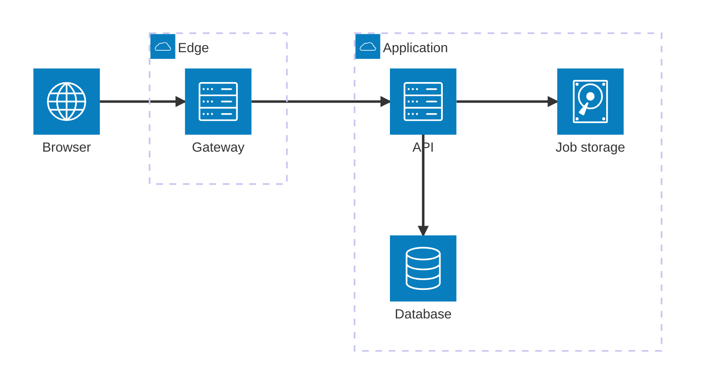

# Architecture diagrams

```mermaid
architecture-beta
  group edge(cloud)[Edge]
  group app(cloud)[Application]
  service browser(internet)[Browser]
  service gateway(server)[Gateway] in edge
  service api(server)[API] in app
  service db(database)[Database] in app
  service jobs(disk)[Job storage] in app
  browser:R --> L:gateway
  gateway:R --> L:api
  api:B --> T:db
  api:R --> L:jobs
```

Nested groups, repeated services, ports, arrow directions, and alignment:

```mermaid
architecture-beta
  group cloud(cloud)[Cloud]
  group data(database)[Data platform] in cloud
  service web(server)[Web] in cloud
  service worker(server)[Worker] in cloud
  service primary(database)[Primary] in data
  service replica(database)[Replica] in data
  service events(queue)[Events] in cloud
  web:R --> L:events
  events:R --> L:worker
  worker:B --> T:primary
  primary:R --> L:replica
  align column primary replica
```
