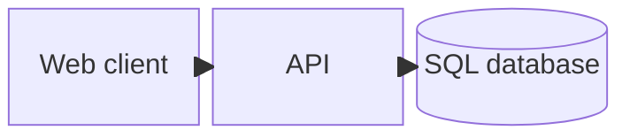
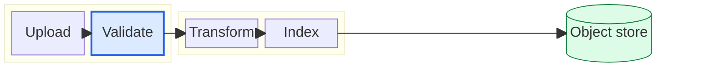

# Block diagrams

```mermaid
block
  columns 3
  Frontend["Web client"]
  API
  Database[("SQL database")]
  Frontend --> API
  API --> Database
```

Blocks, explicit columns, grouped regions, spaces, and directional arrows:

```mermaid
block
  columns 4
  block:INGEST
    A["Upload"]
    B["Validate"]
  end
  block:PROCESS
    C["Transform"]
    D["Index"]
  end
  space
  Store[("Object store")]
  A --> B
  B --> C
  C --> D
  D --> Store
  style B fill:#dbeafe,stroke:#2563eb,stroke-width:2px
  style Store fill:#dcfce7,stroke:#15803d
```
