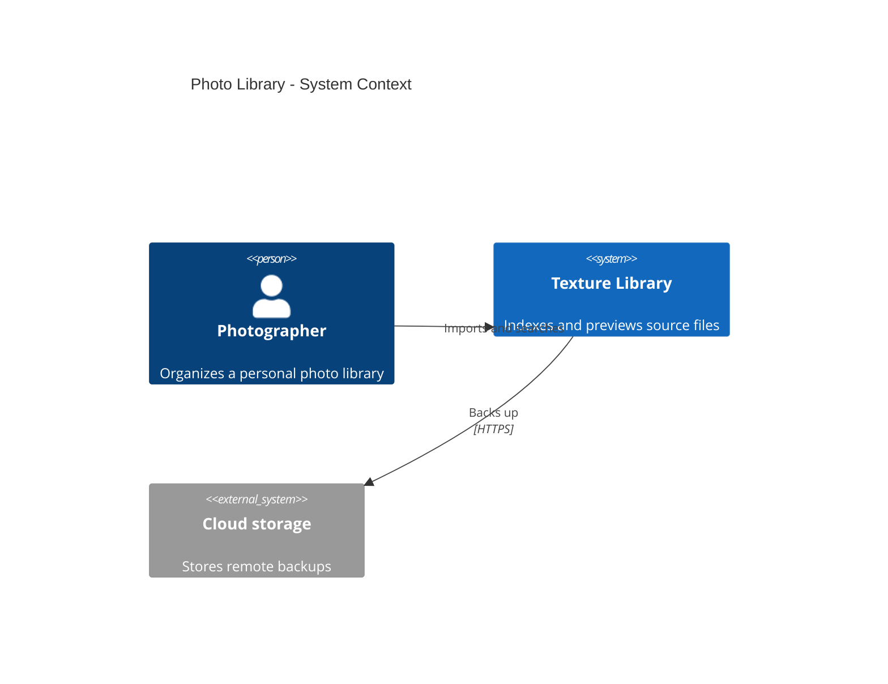
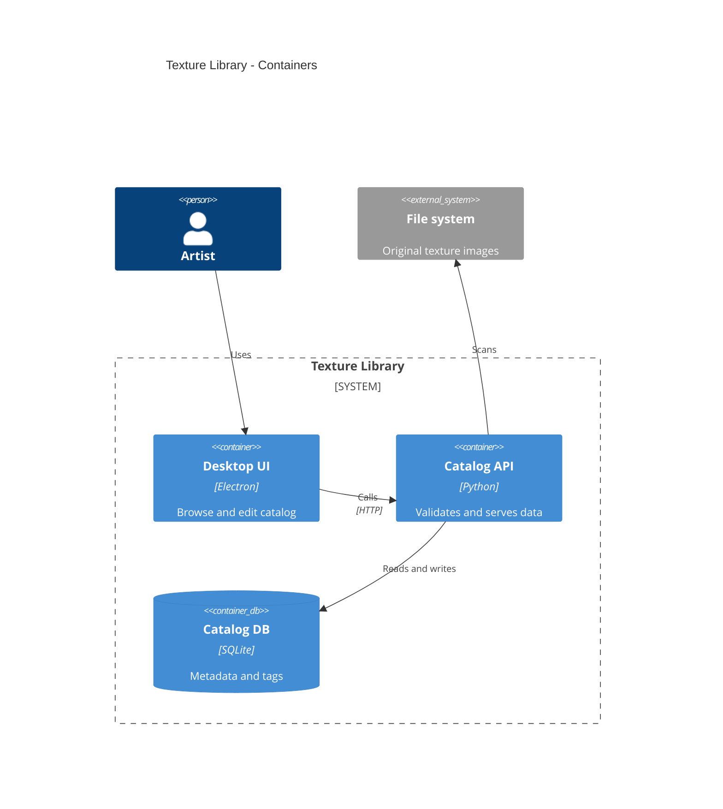
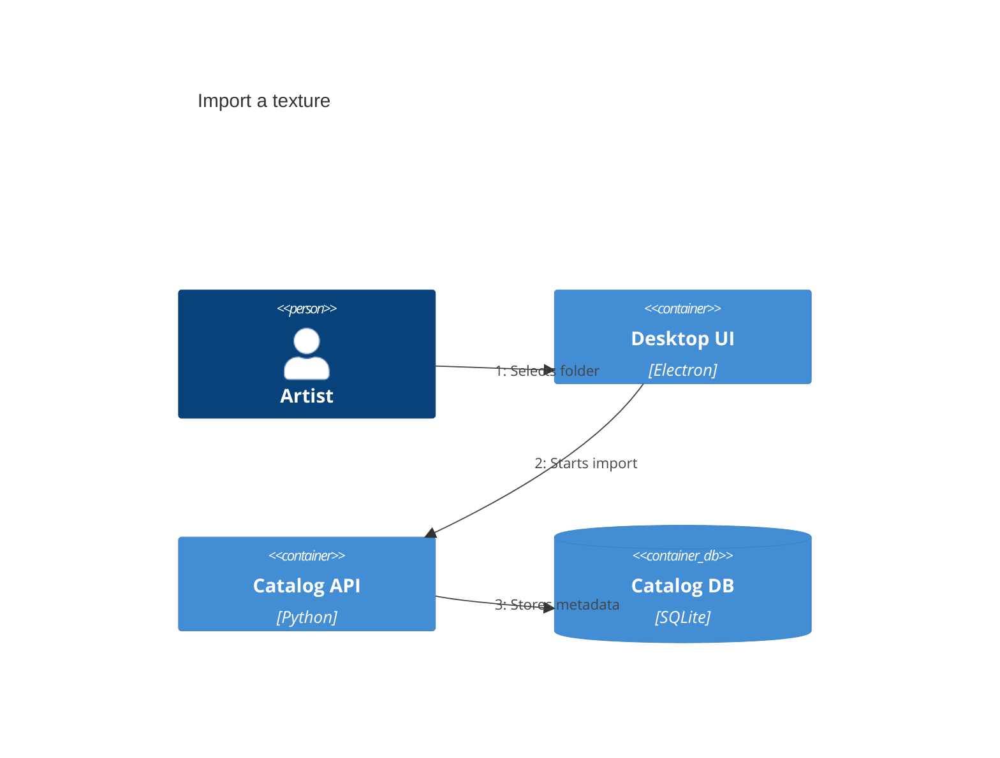
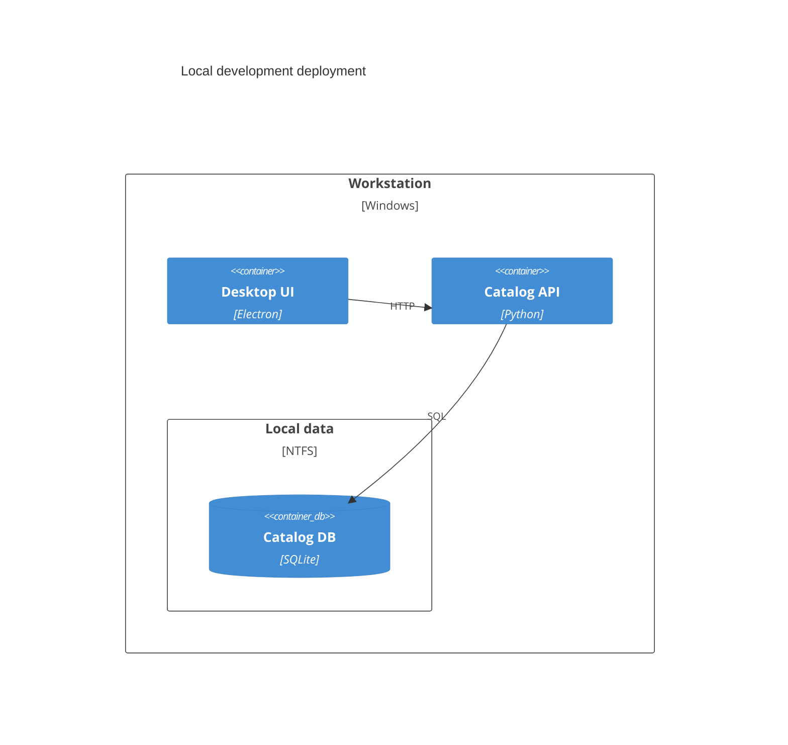

# C4 diagrams

## System context

```mermaid
C4Context
  title Photo Library - System Context
  Person(user, "Photographer", "Organizes a personal photo library")
  System(library, "Texture Library", "Indexes and previews source files")
  System_Ext(cloud, "Cloud storage", "Stores remote backups")
  Rel(user, library, "Imports and searches")
  Rel(library, cloud, "Backs up", "HTTPS")
```

## Containers and components

```mermaid
C4Container
  title Texture Library - Containers
  Person(user, "Artist")
  System_Boundary(app, "Texture Library") {
    Container(ui, "Desktop UI", "Electron", "Browse and edit catalog")
    Container(api, "Catalog API", "Python", "Validates and serves data")
    ContainerDb(db, "Catalog DB", "SQLite", "Metadata and tags")
  }
  System_Ext(files, "File system", "Original texture images")
  Rel(user, ui, "Uses")
  Rel(ui, api, "Calls", "HTTP")
  Rel(api, db, "Reads and writes")
  Rel(api, files, "Scans")
```

## Dynamic and deployment views

```mermaid
C4Dynamic
  title Import a texture
  Person(user, "Artist")
  Container(ui, "Desktop UI", "Electron")
  Container(api, "Catalog API", "Python")
  ContainerDb(db, "Catalog DB", "SQLite")
  RelIndex(1, user, ui, "Selects folder")
  RelIndex(2, ui, api, "Starts import")
  RelIndex(3, api, db, "Stores metadata")
```

```mermaid
C4Deployment
  title Local development deployment
  Deployment_Node(workstation, "Workstation", "Windows") {
    Container(ui, "Desktop UI", "Electron")
    Container(api, "Catalog API", "Python")
    Deployment_Node(local, "Local data", "NTFS") {
      ContainerDb(db, "Catalog DB", "SQLite")
    }
  }
  Rel(ui, api, "HTTP")
  Rel(api, db, "SQL")
```
