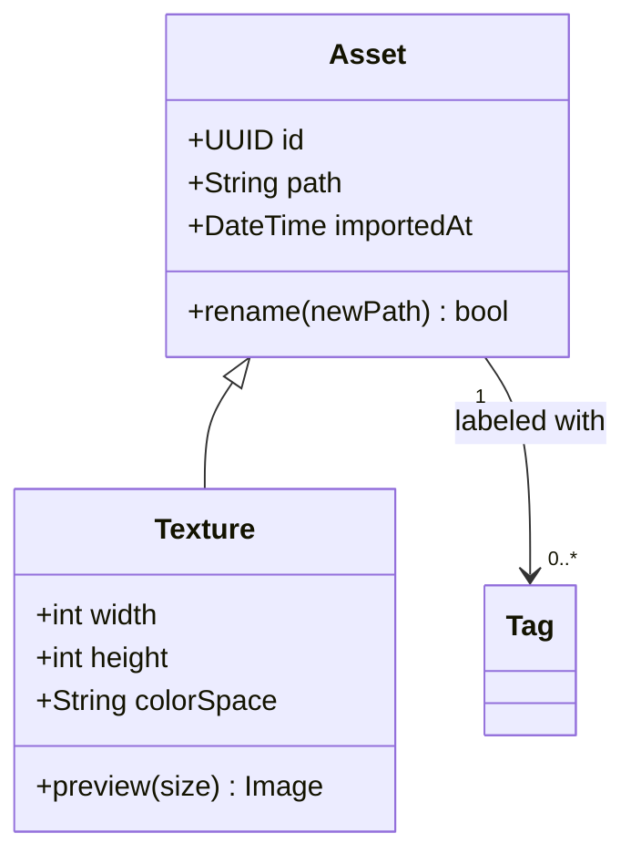
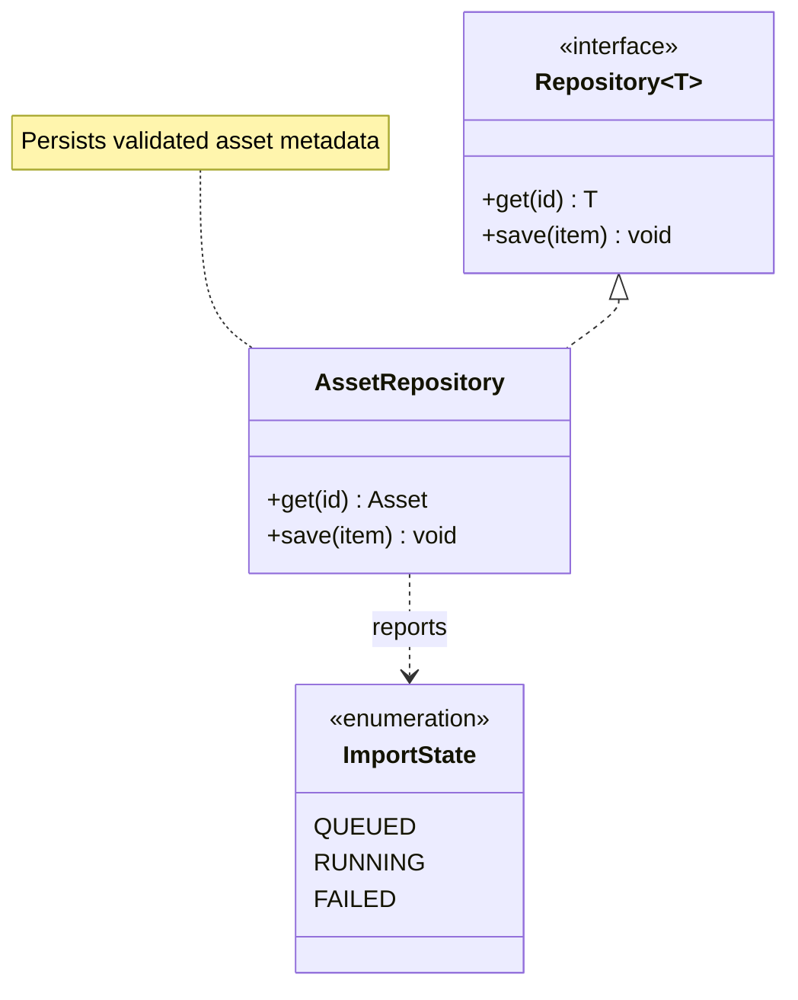

# Class diagrams

```mermaid
classDiagram
  class Asset {
    +UUID id
    +String path
    +DateTime importedAt
    +rename(newPath) bool
  }
  class Texture {
    +int width
    +int height
    +String colorSpace
    +preview(size) Image
  }
  Asset <|-- Texture
  Asset "1" --> "0..*" Tag : labeled with
```

Interfaces, enumerations, generics, visibility, notes, and multiplicities:

```mermaid
classDiagram
  class Repository~T~ {
    <<interface>>
    +get(id) T
    +save(item) void
  }
  class AssetRepository {
    +get(id) Asset
    +save(item) void
  }
  class ImportState {
    <<enumeration>>
    QUEUED
    RUNNING
    FAILED
  }
  Repository~Asset~ <|.. AssetRepository
  AssetRepository ..> ImportState : reports
  note for AssetRepository "Persists validated asset metadata"
```
