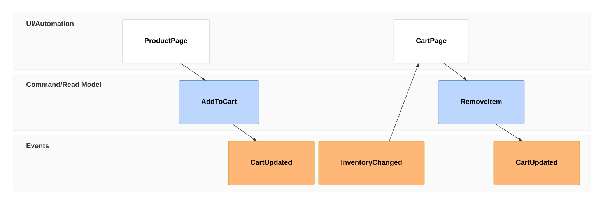

# Event modeling

Frames, inline payloads, explicit data blocks, and repeated event types:

```mermaid
eventmodeling
  tf 01 ui CartScreen
  tf 02 cmd AddItem { sku: string, quantity: number }
  tf 03 evt ItemAdded [[ItemAdded]]
  tf 04 view CartView
  tf 05 cmd Checkout [[Checkout]]
  tf 06 evt OrderPlaced [[OrderPlaced]]

  data ItemAdded {
    sku: string
    quantity: number
    unitPrice: decimal
  }
  data Checkout {
    paymentMethod: string
  }
  data OrderPlaced {
    orderId: uuid
    total: decimal
  }
```

Reset frames and a second user interaction:

```mermaid
eventmodeling
  timeframe 01 ui ProductPage
  timeframe 02 command AddToCart
  timeframe 03 event CartUpdated
  resetframe 04 event InventoryChanged
  timeframe 05 ui CartPage
  timeframe 06 command RemoveItem
  timeframe 07 event CartUpdated
```
