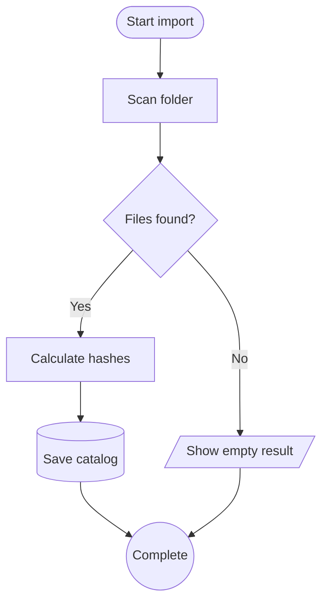
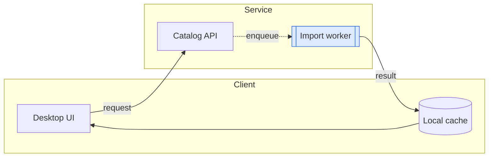

# Flowcharts

```mermaid
flowchart TD
  Start([Start import]) --> Scan[Scan folder]
  Scan --> Valid{Files found?}
  Valid -->|Yes| Hash[Calculate hashes]
  Valid -->|No| Empty[/Show empty result/]
  Hash --> Save[(Save catalog)]
  Save --> Done((Complete))
  Empty --> Done
```

Subgraphs, edge labels, different directions, styling, and dotted links:

```mermaid
flowchart LR
  subgraph Client
    UI[Desktop UI]
    Cache[(Local cache)]
  end
  subgraph Service
    API[Catalog API]
    Worker[[Import worker]]
  end
  UI -->|request| API
  API -.->|enqueue| Worker
  Worker -->|result| Cache
  Cache --> UI
  style Worker fill:#dbeafe,stroke:#2563eb
```
