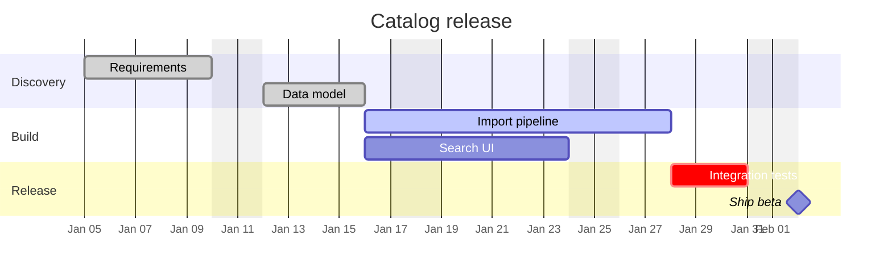
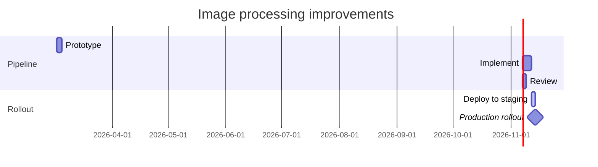

# Gantt charts

```mermaid
gantt
  title Catalog release
  dateFormat YYYY-MM-DD
  axisFormat %b %d
  excludes weekends
  section Discovery
    Requirements :done, req, 2026-01-05, 5d
    Data model :done, model, after req, 4d
  section Build
    Import pipeline :active, import, after model, 8d
    Search UI :search, after model, 6d
  section Release
    Integration tests :crit, tests, after import, 3d
    Ship beta :milestone, beta, after tests, 0d
```

Relative durations, dependencies, inactive work, and a milestone:

```mermaid
gantt
  title Image processing improvements
  dateFormat YYYY-MM-DD
  section Pipeline
    Prototype :2026-03-02, 3d
    Implement :implement, after prototype, 5d
    Review :review, after prototype, 2d
  section Rollout
    Deploy to staging :active, deploy, after implement, 2d
    Production rollout :milestone, rollout, after deploy, 0d
```
