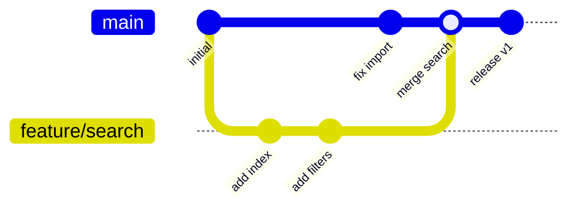
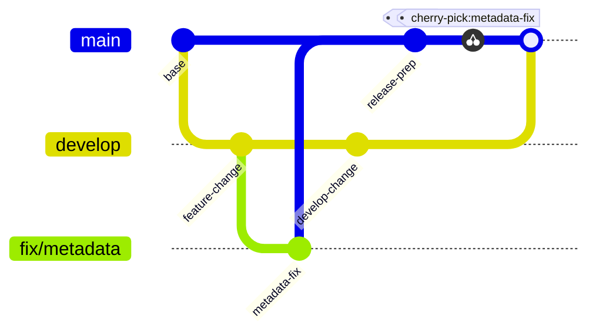

# Git graph diagrams

```mermaid
gitGraph
  commit id: "initial"
  branch feature/search
  checkout feature/search
  commit id: "add index"
  commit id: "add filters"
  checkout main
  commit id: "fix import"
  merge feature/search id: "merge search"
  commit id: "release v1"
```

Branches, tags, cherry-picks, reverse ordering, and commits on both branches:

```mermaid
gitGraph LR:
  commit id: "base"
  branch develop
  checkout develop
  commit id: "feature-change"
  branch fix/metadata
  commit id: "metadata-fix"
  checkout develop
  commit id: "develop-change"
  checkout main
  commit id: "release-prep" tag: "v2.0-rc"
  cherry-pick id: "metadata-fix"
  merge develop
```
