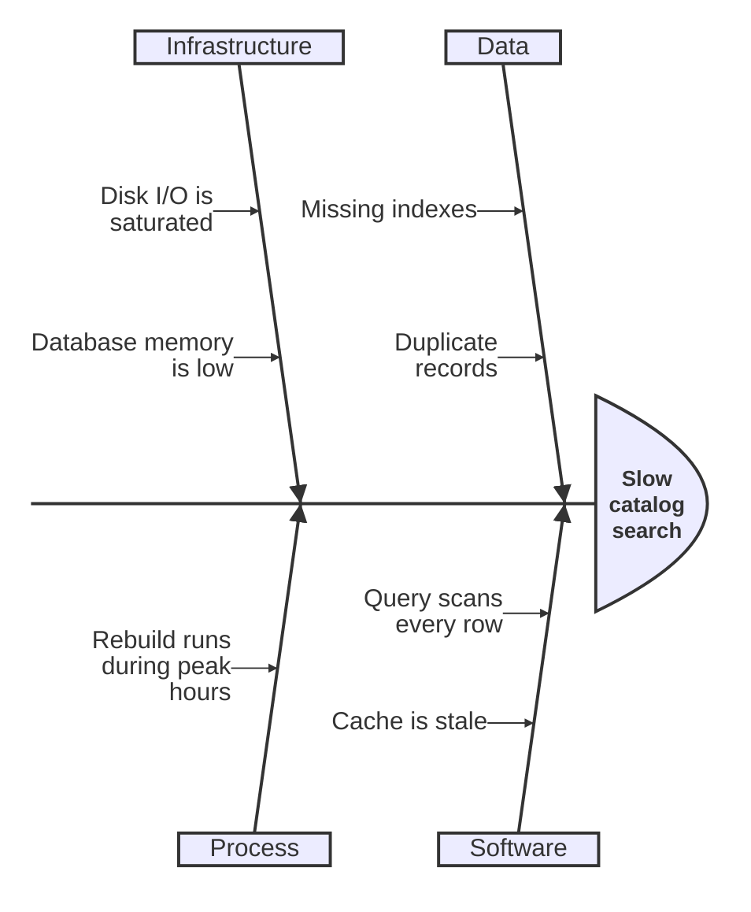
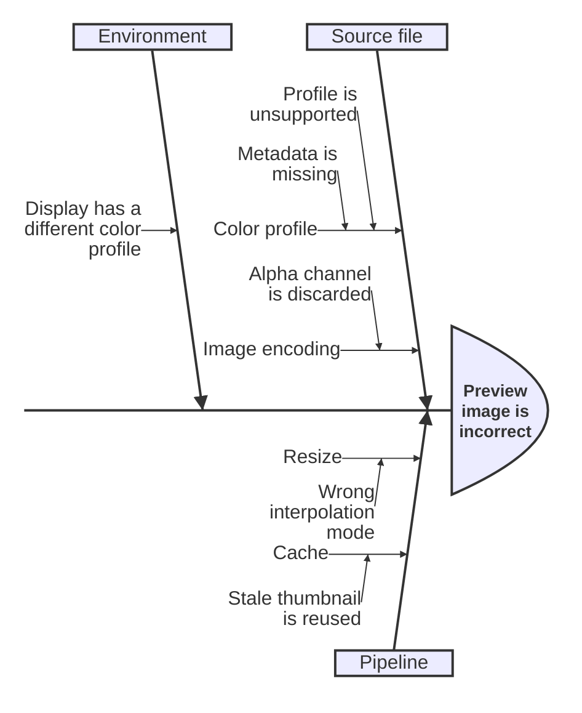

# Ishikawa (fishbone) diagrams

```mermaid
ishikawa-beta
  Slow catalog search
    Data
      Missing indexes
      Duplicate records
    Software
      Query scans every row
      Cache is stale
    Infrastructure
      Disk I/O is saturated
      Database memory is low
    Process
      Rebuild runs during peak hours
```

Nested causes and multiple branches:

```mermaid
ishikawa-beta
  Preview image is incorrect
    Source file
      Color profile
        Profile is unsupported
        Metadata is missing
      Image encoding
        Alpha channel is discarded
    Pipeline
      Resize
        Wrong interpolation mode
      Cache
        Stale thumbnail is reused
    Environment
      Display has a different color profile
```
