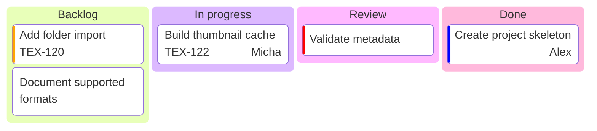
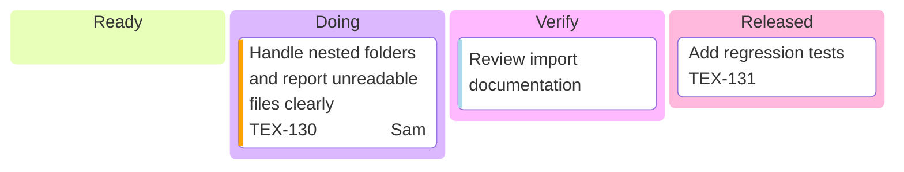

# Kanban boards

```mermaid
kanban
  backlog[Backlog]
    story1[Add folder import]@{ ticket: TEX-120, priority: High }
    story2[Document supported formats]
  doing[In progress]
    story3[Build thumbnail cache]@{ assigned: 'Micha', ticket: TEX-122 }
  review[Review]
    story4[Validate metadata]@{ priority: 'Very High' }
  done[Done]
    story5[Create project skeleton]@{ assigned: 'Alex', priority: Low }
```

Tasks with a long label, assignees, tickets, priorities, and empty columns:

```mermaid
kanban
  todo[Ready]
  active[Doing]
    import[Handle nested folders and report unreadable files clearly]@{ ticket: TEX-130, assigned: 'Sam', priority: 'High' }
  verify[Verify]
    docs[Review import documentation]@{ priority: 'Very Low' }
  done[Released]
    tests[Add regression tests]@{ ticket: TEX-131 }
```
