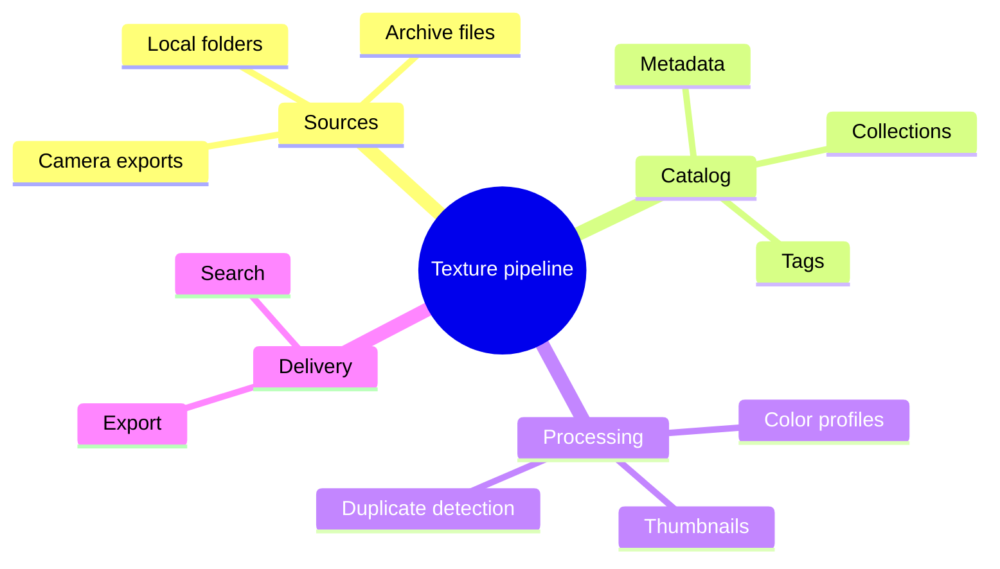
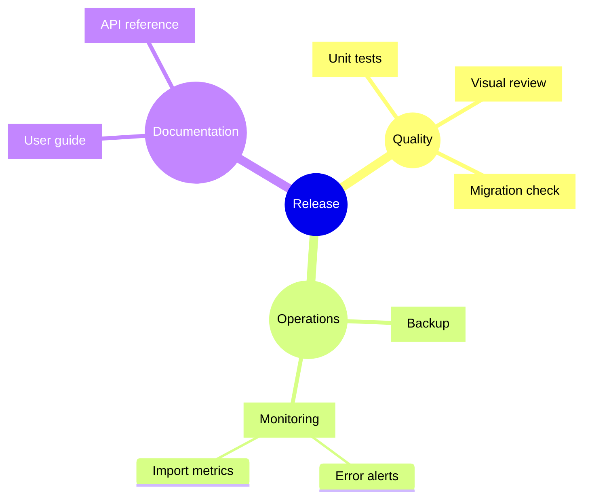

# Mindmaps

```mermaid
mindmap
  root((Texture pipeline))
    Sources
      Local folders
      Archive files
      Camera exports
    Catalog
      Metadata
      Tags
      Collections
    Processing
      Thumbnails
      Color profiles
      Duplicate detection
    Delivery
      Search
      Export
```

Parenthesized nodes, markdown labels, and a deeper branch:

```mermaid
mindmap
  root((Release))
    ((Quality))
      [Unit tests]
      [Visual review]
      [Migration check]
    ((Operations))
      [Backup]
      [Monitoring]
        Error alerts
        Import metrics
    ((Documentation))
      [User guide]
      [API reference]
```
