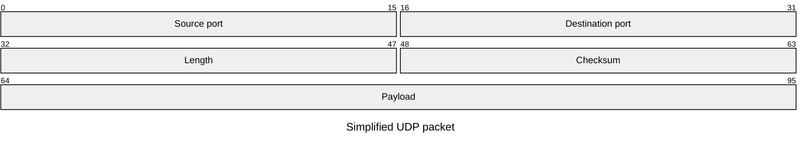
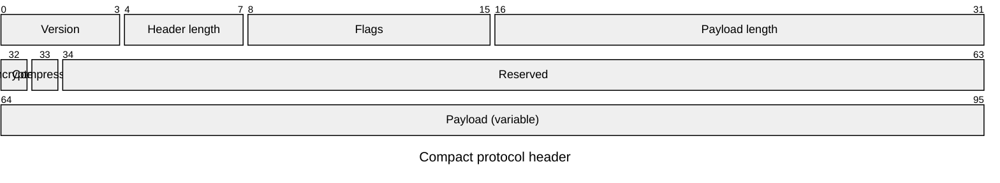

# Packet diagrams

```mermaid
packet
  title Simplified UDP packet
  +16: "Source port"
  +16: "Destination port"
  +16: "Length"
  +16: "Checksum"
  +32: "Payload"
```

Explicit bit ranges, single-bit flags, and a final variable-length field:

```mermaid
packet
  title Compact protocol header
  0-3: "Version"
  4-7: "Header length"
  8-15: "Flags"
  16-31: "Payload length"
  32: "Encrypted"
  33: "Compressed"
  34-63: "Reserved"
  64-95: "Payload (variable)"
```
