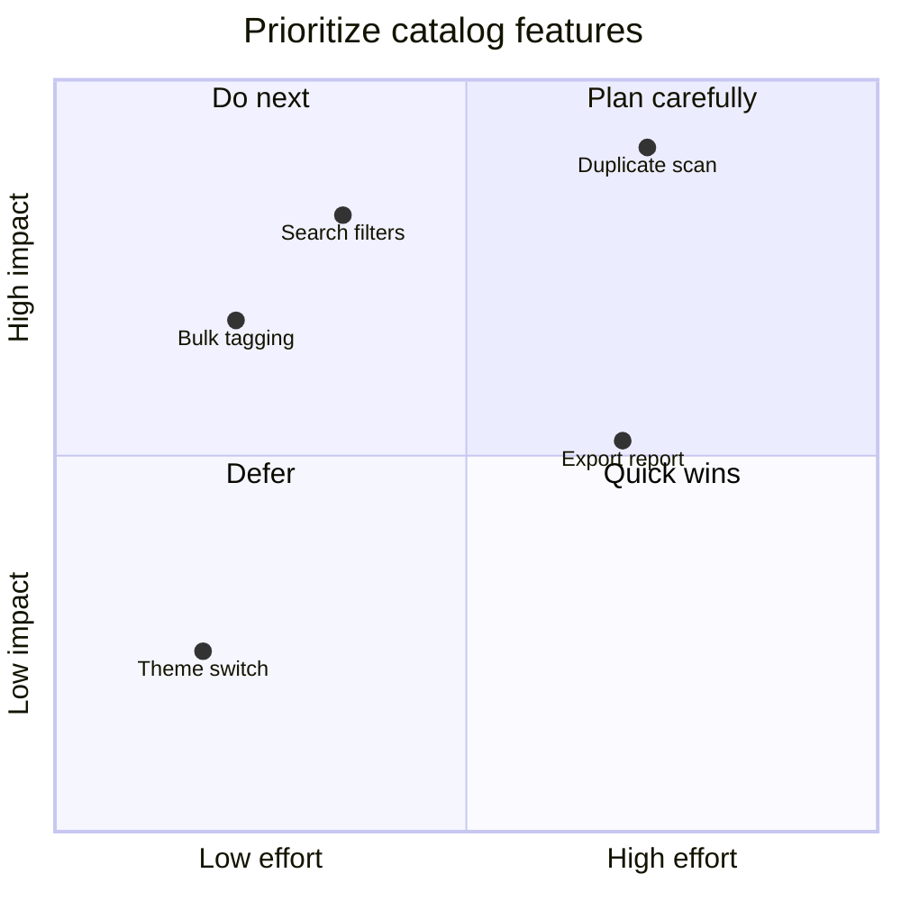
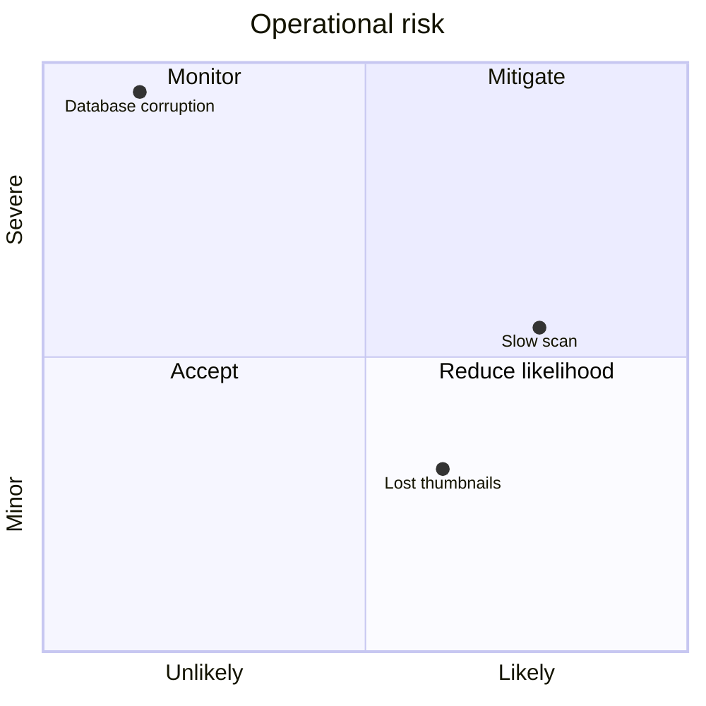

# Quadrant charts

```mermaid
quadrantChart
  title Prioritize catalog features
  x-axis Low effort --> High effort
  y-axis Low impact --> High impact
  quadrant-1 Plan carefully
  quadrant-2 Do next
  quadrant-3 Defer
  quadrant-4 Quick wins
  Search filters: [0.35, 0.82]
  Bulk tagging: [0.22, 0.68]
  Theme switch: [0.18, 0.24]
  Duplicate scan: [0.72, 0.91]
  Export report: [0.69, 0.52]
```

```mermaid
quadrantChart
  title Operational risk
  x-axis Unlikely --> Likely
  y-axis Minor --> Severe
  quadrant-1 Mitigate
  quadrant-2 Monitor
  quadrant-3 Accept
  quadrant-4 Reduce likelihood
  Lost thumbnails: [0.62, 0.31]
  Database corruption: [0.15, 0.95]
  Slow scan: [0.77, 0.55]
```
