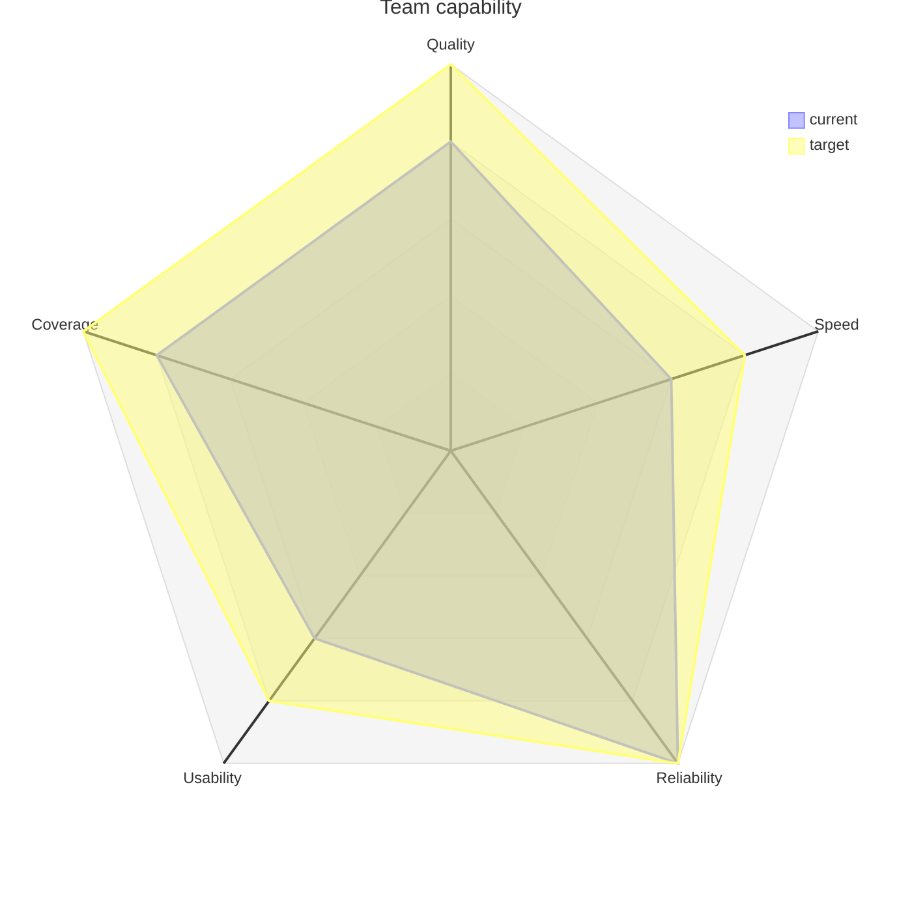
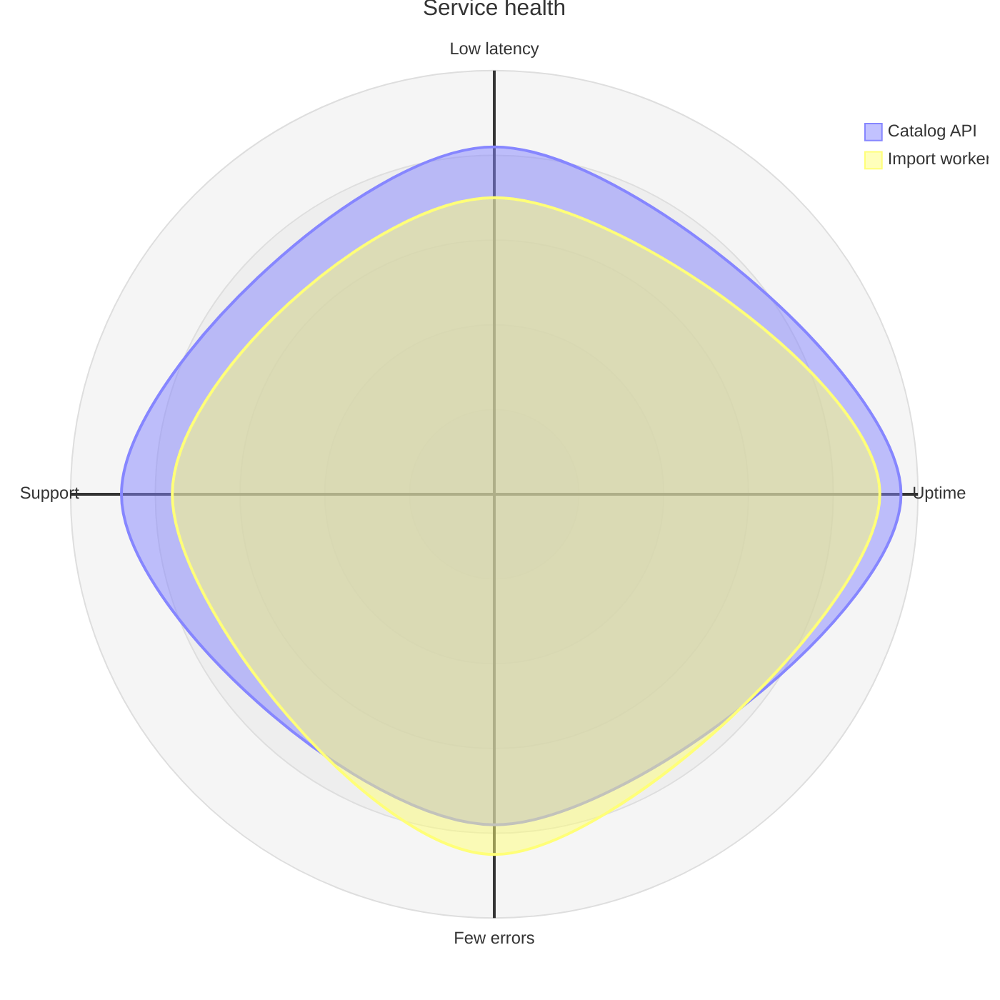

# Radar charts

```mermaid
radar-beta
  title Team capability
  axis Quality, Speed, Reliability, Usability, Coverage
  curve current{4, 3, 5, 3, 4}
  curve target{5, 4, 5, 4, 5}
  max 5
  min 0
  graticule polygon
  ticks 5
```

Named axes, multiple curves, and explicit bounds:

```mermaid
radar-beta
  title Service health
  axis latency["Low latency"], uptime["Uptime"], errors["Few errors"], support["Support"]
  curve api["Catalog API"]{82, 96, 78, 88}
  curve worker["Import worker"]{70, 91, 85, 76}
  min 0
  max 100
  graticule circle
  showLegend true
```
