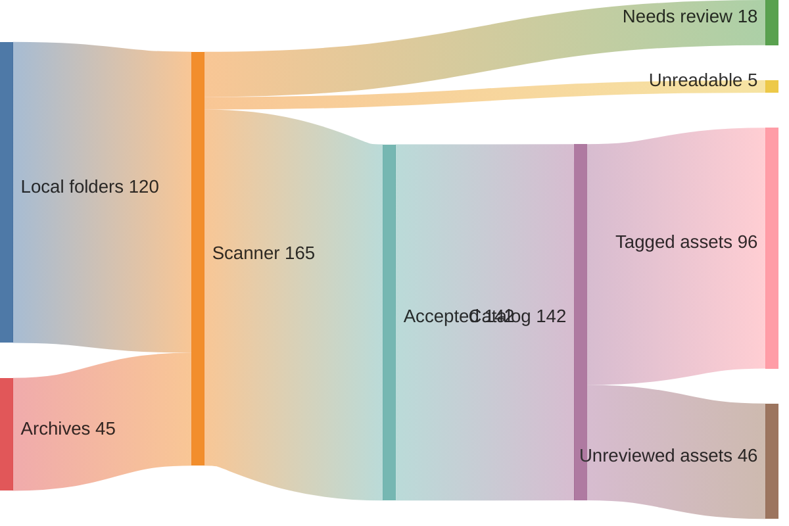
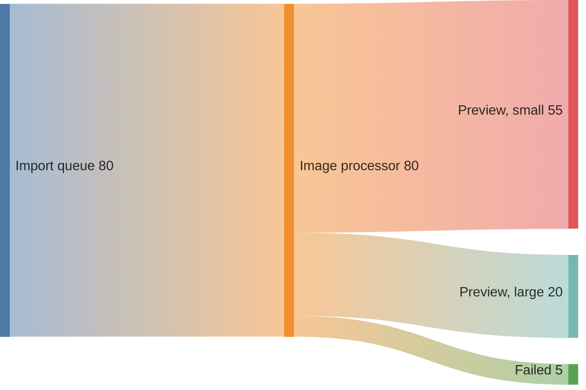

# Sankey diagrams

```mermaid
sankey

%% source,target,value
Local folders,Scanner,120
Archives,Scanner,45
Scanner,Accepted,142
Scanner,Needs review,18
Scanner,Unreadable,5
Accepted,Catalog,142
Catalog,Tagged assets,96
Catalog,Unreviewed assets,46
```

Quoted CSV labels containing commas:

```mermaid
sankey

%% source,target,value
Import queue,Image processor,80
Image processor,"Preview, small",55
Image processor,"Preview, large",20
Image processor,Failed,5
```
