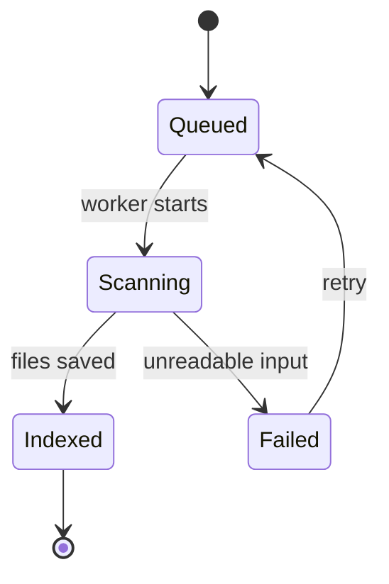
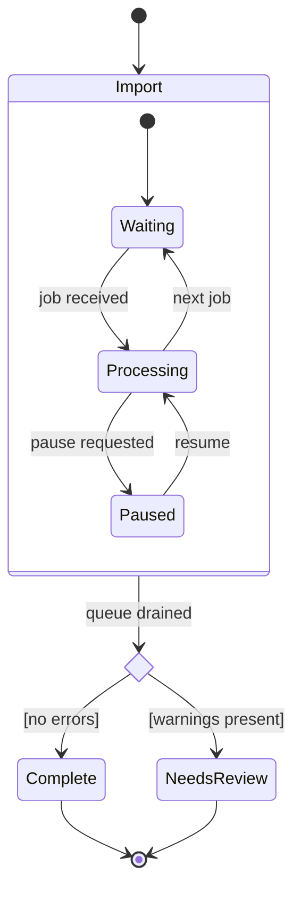

# State diagrams

```mermaid
stateDiagram-v2
  [*] --> Queued
  Queued --> Scanning : worker starts
  Scanning --> Indexed : files saved
  Scanning --> Failed : unreadable input
  Failed --> Queued : retry
  Indexed --> [*]
```

Composite states, history, guards, and choice:

```mermaid
stateDiagram-v2
  [*] --> Import
  state Import {
    [*] --> Waiting
    Waiting --> Processing : job received
    Processing --> Waiting : next job
    Processing --> Paused : pause requested
    Paused --> Processing : resume
  }
  state result <<choice>>
  Import --> result : queue drained
  result --> Complete : [no errors]
  result --> NeedsReview : [warnings present]
  Complete --> [*]
  NeedsReview --> [*]
```
