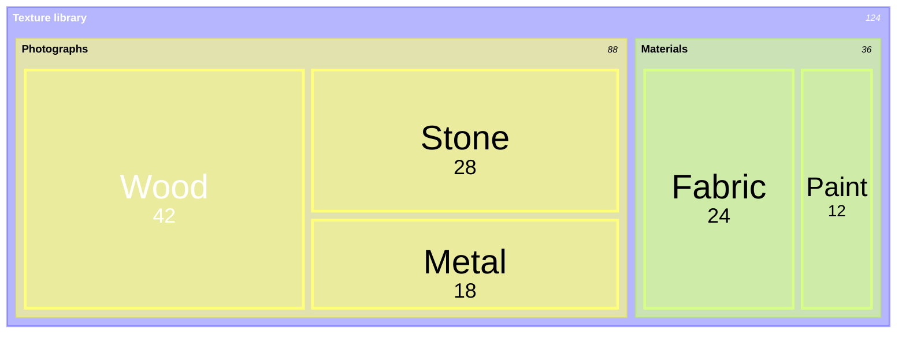
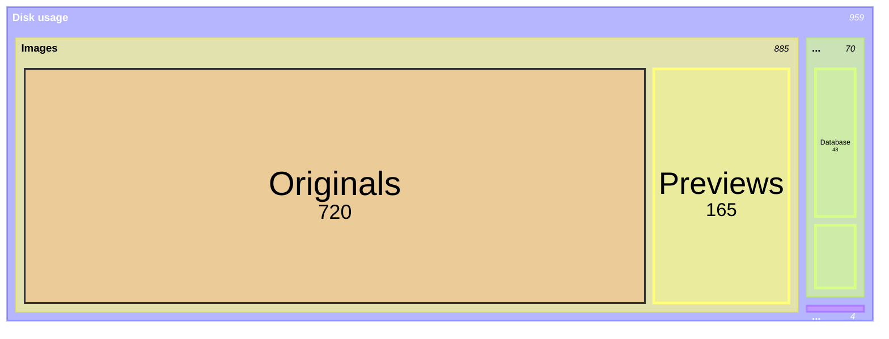

# Treemap diagrams

```mermaid
treemap-beta
"Texture library"
  "Photographs"
    "Wood": 42
    "Stone": 28
    "Metal": 18
  "Materials"
    "Fabric": 24
    "Paint": 12
```

Nested categories, zero/small values, and class styling:

```mermaid
treemap-beta
"Disk usage"
  "Images"
    "Originals": 720:::important
    "Previews": 165
  "Metadata"
    "Database": 48
    "Search index": 22
  "Logs"
    "Current": 4
    "Archived": 0

classDef important fill:#f96,stroke:#333,stroke-width:2px;
```
