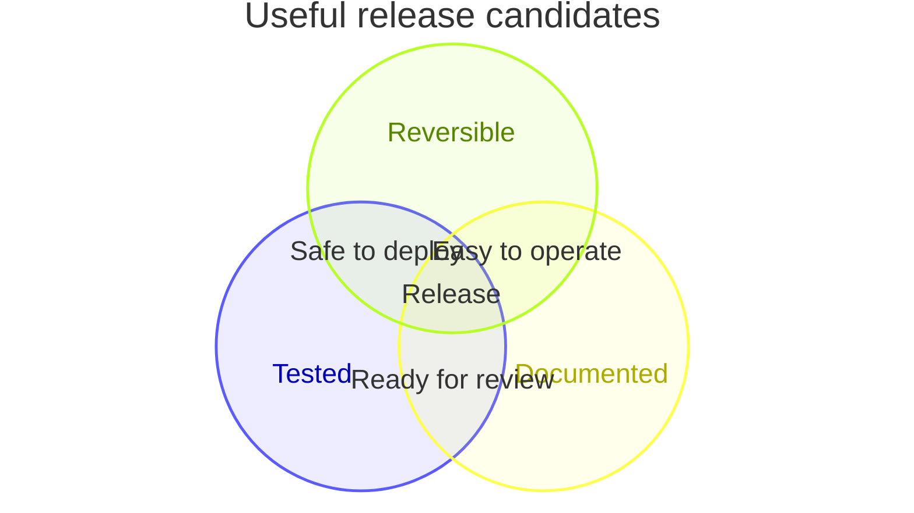
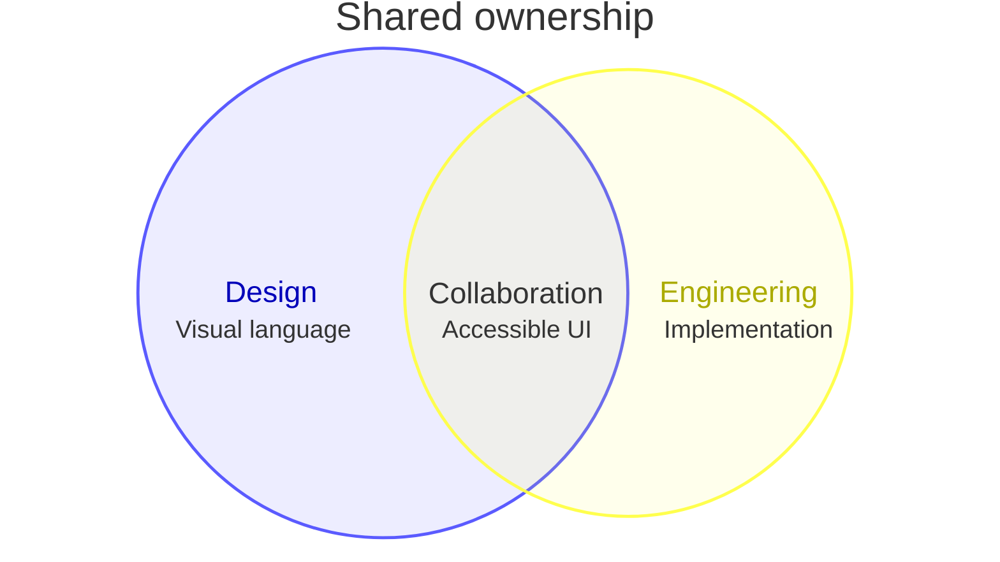

# Venn diagrams

```mermaid
venn-beta
  title Useful release candidates
  set Tested
  set Documented
  set Reversible
  union Tested,Documented["Ready for review"]
  union Tested,Reversible["Safe to deploy"]
  union Documented,Reversible["Easy to operate"]
  union Tested,Documented,Reversible["Release"]
```

Set sizes, labels inside sets, and a shared intersection:

```mermaid
venn-beta
  title Shared ownership
  set Design["Design"]:12
    text design1["Visual language"]
  set Engineering["Engineering"]:10
    text engineering1["Implementation"]
  union Design,Engineering["Collaboration"]:4
    text shared1["Accessible UI"]
```
