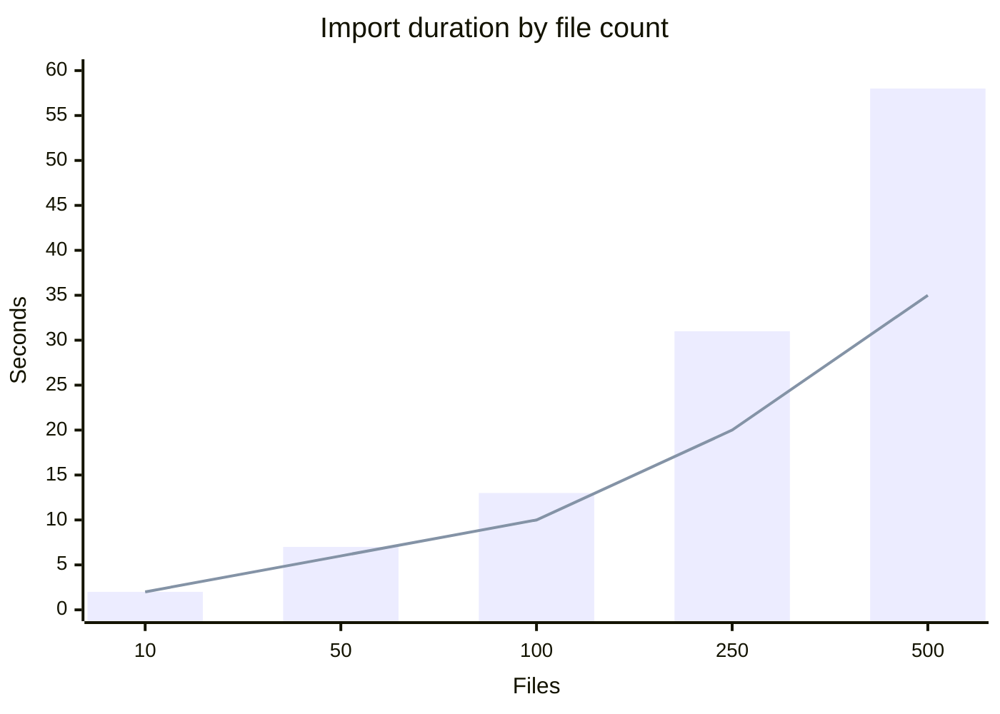
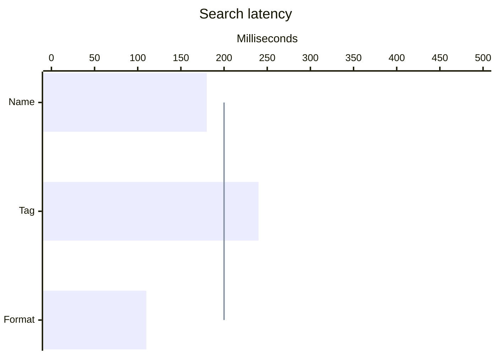

# XY charts

```mermaid
xychart-beta
  title "Import duration by file count"
  x-axis "Files" [10, 50, 100, 250, 500]
  y-axis "Seconds" 0 --> 60
  bar "Current scanner" [2, 7, 13, 31, 58]
  line "Target" [2, 6, 10, 20, 35]
```

Horizontal orientation, categorical labels, and multiple line series:

```mermaid
xychart-beta horizontal
  title "Search latency"
  x-axis ["Name", "Tag", "Format"]
  y-axis "Milliseconds" 0 --> 500
  bar "p95" [180, 240, 110]
  line "Target" [200, 200, 200]
```
