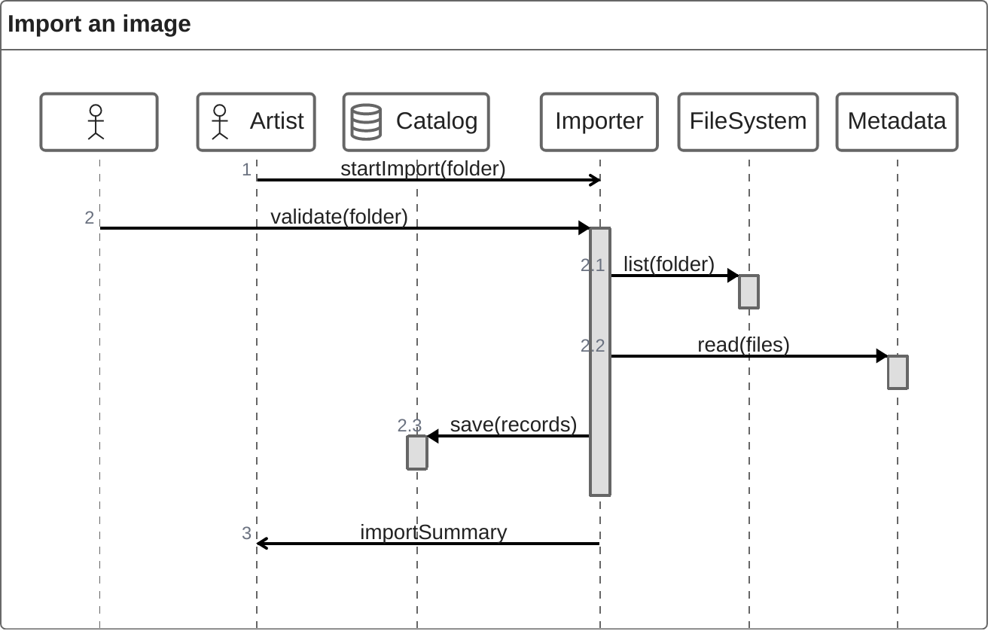
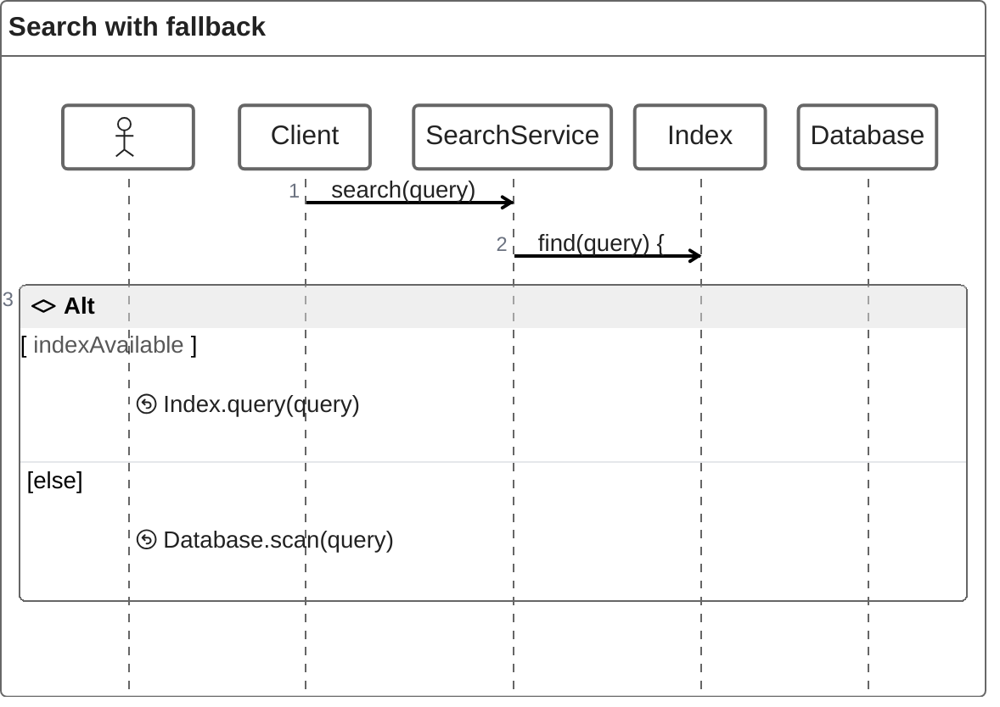

# ZenUML sequence diagrams

```mermaid
zenuml
  title Import an image
  @Actor Artist
  @Database Catalog
  Artist->Importer: startImport(folder)
  Importer.validate(folder) {
    FileSystem.list(folder)
    Metadata.read(files)
    Catalog.save(records)
  }
  Importer->Artist: importSummary
```

Nested calls, conditions, loops, and return values:

```mermaid
zenuml
  title Search with fallback
  Client->SearchService: search(query)
  SearchService->Index: find(query) {
    if(indexAvailable) {
      return Index.query(query)
    } else {
      return Database.scan(query)
    }
  }
  SearchService->Client: results
```
